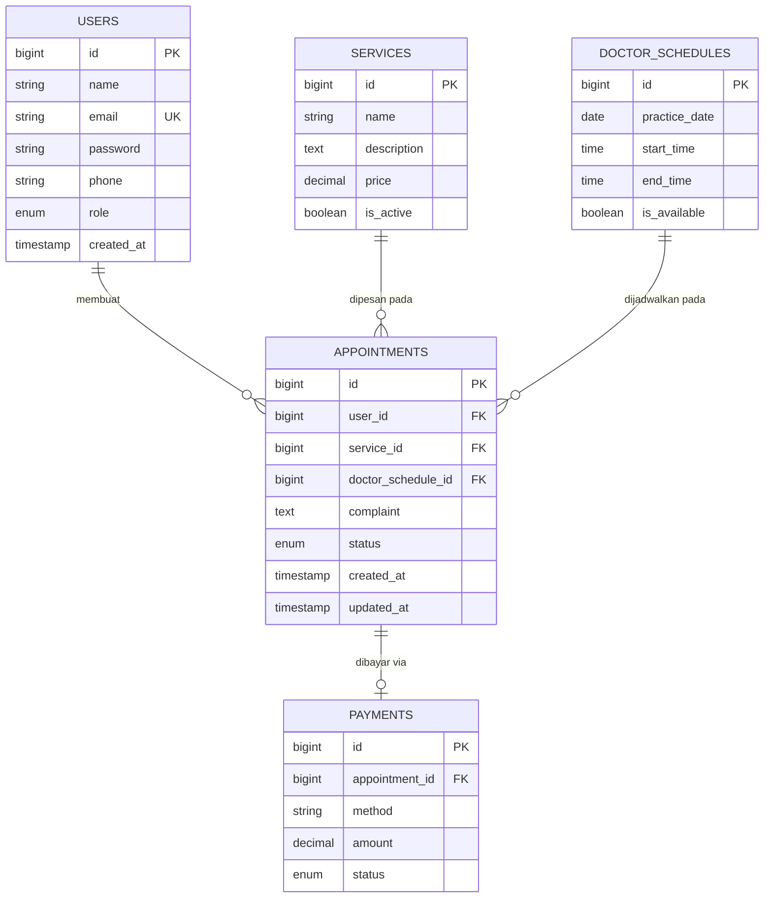

# 🦷 Dental Clinic Appointment API

Sistem Booking & Manajemen Layanan Klinik Gigi — RESTful API berbasis Laravel untuk mengelola sistem pemesanan janji temu (appointment) di klinik gigi. Sistem ini mencakup manajemen antrian pasien, ketersediaan jadwal dokter, pengelolaan layanan klinik, serta dilengkapi dengan autentikasi berbasis role (Admin & Pasien).

## ✨ Fitur Utama

### Admin

- CRUD layanan klinik (tambah, ubah, hapus, lihat) dengan pagination.
- Mengatur jadwal praktek dokter dan status ketersediaan slot waktu.
- Melihat seluruh antrian janji temu/appointment dan mengubah statusnya (`pending`, `selesai`, `batal`).

### Pasien

- Register & login (Laravel Sanctum).
- Melihat daftar layanan klinik beserta detailnya.
- Melihat jadwal dokter yang tersedia.
- Membuat janji temu berdasarkan slot jadwal yang dipilih.
- Melihat riwayat janji temu miliknya sendiri.
- Membatalkan janji temu yang masih berstatus `pending`.

### Lainnya

- **Autentikasi & Otorisasi** — Laravel Sanctum dengan pemisahan hak akses (Role-Based Access Control) antara admin dan pasien via middleware `check_role`.
- **Anti Double-Booking** — Menggunakan *Pessimistic Locking* dan *Database Transactions* untuk mencegah bentrok jadwal pada waktu yang bersamaan (race condition).

## 🛠️ Tech Stack

| Bagian | Teknologi |
|---|---|
| Backend | Laravel 13.x (API-only) |
| Bahasa Pemrograman | PHP 8.3+ |
| Database | MySQL |
| Autentikasi | Laravel Sanctum (Bearer token) |
| Desain Database | dbdiagram.io |

## 🗄️ Entity Relationship Diagram (ERD)



Tabel `payments` disiapkan untuk pengembangan fitur pembayaran di masa mendatang dan belum digunakan secara aktif oleh endpoint yang ada saat ini.

## 🚀 Panduan Instalasi (Local Development)

Ikuti langkah-langkah di bawah ini untuk menjalankan aplikasi di komputer lokal Anda.

### Prasyarat

Pastikan sistem Anda sudah terinstal:

- PHP >= 8.3
- Composer
- MySQL Server

### Langkah-langkah

1. **Clone repositori ini:**

   ```bash
   git clone https://github.com/username-anda/nama-repo-anda.git
   cd nama-repo-anda
   ```

2. **Instal dependensi PHP:**

   ```bash
   composer install
   ```

3. **Salin file pengaturan environment:**

   ```bash
   cp .env.example .env
   ```

4. **Konfigurasi Database**

   Buka file `.env` dan sesuaikan kredensial database Anda:

   ```env
   DB_CONNECTION=mysql
   DB_HOST=127.0.0.1
   DB_PORT=3306
   DB_DATABASE=dental_clinic_db
   DB_USERNAME=root
   DB_PASSWORD=
   ```

5. **Generate Application Key:**

   ```bash
   php artisan key:generate
   ```

6. **Jalankan Migrasi dan Seeder:**

   > Pastikan database `dental_clinic_db` sudah dibuat di MySQL Anda.

   ```bash
   php artisan migrate --seed
   ```

7. **Jalankan Local Development Server:**

   ```bash
   php artisan serve
   ```

   API dapat diakses melalui: `http://127.0.0.1:8000/api`

## 🔗 Struktur Endpoint API

Base URL: `/api`. Endpoint bertanda 🔒 butuh header `Authorization: Bearer <token>`. Endpoint 🔒🛡️ hanya bisa diakses role **admin**.

### Auth

| Method | Endpoint | Auth | Deskripsi |
|---|---|---|---|
| POST | `/register` | — | Mendaftarkan akun pasien baru |
| POST | `/login` | — | Login dan mendapatkan token Sanctum |
| POST | `/logout` | 🔒 | Menghapus token dan keluar |
| GET | `/user` | 🔒 | Mendapatkan data profil user yang sedang login |

### Services

| Method | Endpoint | Auth | Deskripsi |
|---|---|---|---|
| GET | `/services` | — | Melihat daftar layanan klinik (dengan pagination) |
| GET | `/services/{id}` | — | Melihat detail spesifik suatu layanan |
| POST | `/services` | 🔒🛡️ | Menambah layanan baru |
| PUT | `/services/{id}` | 🔒🛡️ | Mengubah data layanan |
| DELETE | `/services/{id}` | 🔒🛡️ | Menghapus data layanan |

### Doctor Schedules

| Method | Endpoint | Auth | Deskripsi |
|---|---|---|---|
| GET | `/doctor-schedules` | 🔒 | Melihat ketersediaan jadwal dokter |
| POST | `/doctor-schedules` | 🔒🛡️ | Membuat jadwal praktek dokter |
| PATCH | `/doctor-schedules/{id}/availability` | 🔒🛡️ | Membuka/menutup ketersediaan slot |

### Appointments

| Method | Endpoint | Auth | Deskripsi |
|---|---|---|---|
| POST | `/appointments` | 🔒 (pasien) | Membuat janji temu baru |
| GET | `/appointments/my` | 🔒 (pasien) | Melihat riwayat janji temu pribadi |
| PATCH | `/appointments/{id}/cancel` | 🔒 (pemilik) | Membatalkan janji temu (jika masih pending) |
| GET | `/appointments` | 🔒🛡️ | Melihat seluruh antrian janji temu |
| PATCH | `/appointments/{id}/status` | 🔒🛡️ | Mengubah status antrian (`selesai`/`batal`) |

> Catatan: rute `/doctor-schedules` (GET) dan seluruh rute `/appointments` berada di bawah middleware `auth:sanctum`, jadi wajib login (bukan pasien saja — sesuai `routes/api.php`).

## 📂 Struktur Folder (ringkas)

```
dentist-api/
├── app/
│   ├── Http/
│   │   ├── Controllers/Api/
│   │   │   ├── AppointmentController.php
│   │   │   ├── AuthController.php
│   │   │   ├── DoctorScheduleController.php
│   │   │   └── ServiceController.php
│   │   ├── Middleware/
│   │   │   └── checkRole.php
│   │   └── Requests/
│   │       ├── StoreAppointmentRequest.php
│   │       ├── StoreDoctorScheduleRequest.php
│   │       └── StoreServiceRequest.php
│   ├── Models/
│   │   ├── Appointment.php
│   │   ├── DoctorSchedule.php
│   │   ├── Payment.php
│   │   ├── Service.php
│   │   └── User.php
│   └── Providers/
├── database/
│   └── migrations/
├── routes/
│   └── api.php
└── ...
```

## 📄 Lisensi

Silakan sesuaikan bagian ini dengan lisensi yang Anda pilih untuk project ini (misalnya MIT License).
